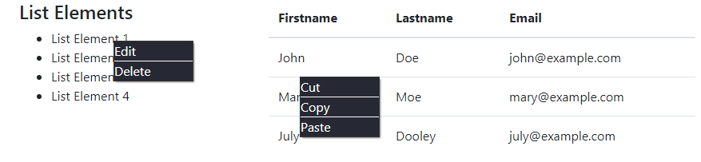

# Context Menu

"contextmenu" is an event like click, mouseup, mousemove, mousedown. This "contextmenu" event is typically triggered by clicking the right mouse button.
By default, clicking right mouse button, you will get cut, copy, pase, inspect menus. In my program, i have created a custom context menu.

